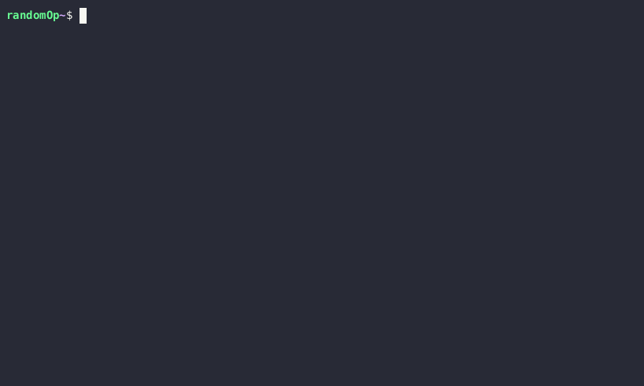

# Cardano Up!

## Overview

This Ruby gem provides easy way for:
 - getting `cardano-node`, `cardano-cli`, `cardano-wallet`, `cardano-addresses` and `bech32` tools onto your system (Linux, MacOS or Windows).
 - getting configuration for any Cardano public environment.
 - starting, managing and monitoring cardano-node and cardano-wallet services.

## Installation

    $ gem install cardano-up

## Usage

It only takes a single command to start node and wallet on your system. Say, on `mainnet`?

    $ cardano-up mainnet node-wallet up

That's it! 🎉

If any configs are missing cardano-up will download them. If any binaries are missing cardano-up will get ones from latest release.

Call `$ cardano-up --help` to explore more options.

## Documentation

| Link | Description  |
|--|--|
|  [Ruby API (edge)](https://piotr-iohk.github.io/cardano-up/master/) | cardano-up API doc |

## How it works

**Configurations** for the networks are downloaded from [Cardano Book](https://book.world.dev.cardano.org/environments.html).

**Binaries** come from [cardano-wallet](https://github.com/input-output-hk/cardano-wallet) which actually provides `cardano-node`, `cardano-cli`, `cardano-wallet`, `cardano-addresses` and `bech32` tools in each of its release bundles. This ensures that all components are compatible and work smoothly together. You can get any public release of the cardano-wallet bundle as well as `master` version and even any of the PRs that are currently being worked on.

**Starting** `cardano-node` and `cardano-wallet`,  cardano-up attempts to launch separate [`screen`](https://www.gnu.org/software/screen/) sessions for wallet and node respectively. If screen is not present on your system you can install it using package manager, e.g.:

MacOS:

    $ brew install screen

Linux:

    $ sudo apt-get install screen

In case of Windows it will attempt to install cardano-node and cardano-wallet as Windows services using [`nssm`](https://nssm.cc/) tool. Nssm can be installed via choco package manager:

    $ choco install nssm

> :warning: nssm requires administrator permissions to register Windows services, therefore you need to start your cmd as an administrator.

By default cardano-up keeps all files at `$HOME/.cardano-up/` however this can be configured by editing `$HOME/.cardano-up/.cardano-up.json` directly or via `config` sub-command. One can check the contents of this internal config file by calling `$ cardano-up config`.

## License

The gem is available as open source under the terms of the [MIT License](https://opensource.org/licenses/MIT).
